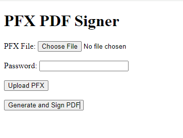

## PDF signinig on nodejs server

### installation

Use nodejs 12 onwards and open this directory in command line. Run below commands-
```
npm install
node server.js
```

Above commands will start a simple webserver. Open below link

```
http://localhost:3000/
```



As shown in above UI, upload PFX file and the paraphrase. Then hit generate PDF. At the moment server will generate a simple PDF file and sign it with the uploaded PFX file. As you can see the PFX and paraphrase is now stored under 'uploads' directory. These keys can be used later to sign the PDFs without problem.

I couldnt use your provided PDF, but should be straight forward to do it.

